#  Hackmeet

Hackmeet is a collaborative platform designed to help students discover hackathons, create or join teams, connect with other participants, and collaborate through real-time communication.

The platform provides a centralized ecosystem for:

- Discovering hackathons
- Creating and joining teams
- Finding potential team members
- Real-time one-to-one communication
- GitHub repository integration
- User profile management
- Notifications
- Admin-level hackathon management

---

## Key Features

### 👤 User Management

- User registration and authentication
- JWT-based authentication
- User profile management
- Profile image upload using Cloudinary
- Role-based access control

### 👥 Team Management

- Create teams
- Join existing teams
- Manage team members
- View team details
- Connect teams with GitHub repositories

### 🏆 Hackathon Management

- Browse hackathons
- View hackathon details
- Create and manage hackathons
- Admin-controlled hackathon management

### 💬 Real-Time Communication

- One-to-one conversations
- Real-time message delivery
- Socket.io-powered communication
- Persistent conversations and messages

### 🔔 Notifications

- Application notifications
- Team-related notifications
- Telegram bot notification integration

### 🐙 GitHub Integration

- Fetch public GitHub repository information
- Display team repository details
- GitHub API integration using authenticated requests

---

##  System Architecture

Hackmeet follows a layered client-server architecture. The React frontend communicates with the Node.js and Express.js backend through REST APIs and WebSockets. The backend processes requests through API routes, middleware, and controller modules before interacting with MongoDB or external services.

```mermaid
flowchart TB

    %% =========================
    %% CLIENT LAYER
    %% =========================

    subgraph CLIENT["Client Layer"]

        USER1["Student / User"]
        USER2["Team Member"]
        ADMIN["Administrator"]

        FRONTEND["React + Vite Frontend<br/>Component-Based UI<br/>Deployed on Netlify"]

        USER1 --> FRONTEND
        USER2 --> FRONTEND
        ADMIN --> FRONTEND

    end


    %% =========================
    %% COMMUNICATION LAYER
    %% =========================

    subgraph COMMUNICATION["Communication Layer"]

        REST["HTTP REST API"]
        WEBSOCKET["WebSocket Connection"]

    end

    FRONTEND -->|HTTP Requests| REST
    FRONTEND <-->|Real-Time Communication| WEBSOCKET


    %% =========================
    %% BACKEND LAYER
    %% =========================

    subgraph BACKEND["Backend Layer<br/>Node.js + Express.js<br/>Deployed on Render"]

        ROUTES["API Routes"]

        MIDDLEWARE["Middleware Layer"]

        CONTROLLER_LAYER["Controller Layer"]

        SOCKET["Socket.io Server"]

        ROUTES --> MIDDLEWARE
        MIDDLEWARE --> CONTROLLER_LAYER

    end


    REST --> ROUTES
    WEBSOCKET --> SOCKET


    %% =========================
    %% MIDDLEWARE
    %% =========================

    subgraph SECURITY["Security & Request Processing"]

        CORS["CORS Middleware"]
        JWT["JWT Token Verification"]
        ROLE["Admin Role Verification"]

    end

    MIDDLEWARE --> CORS
    MIDDLEWARE --> JWT
    MIDDLEWARE --> ROLE


    %% =========================
    %% CONTROLLER MODULES
    %% =========================

    subgraph CONTROLLER_MODULES["Controller Modules"]

        AUTH["Auth Controller"]
        USER["User Controller"]
        TEAM["Team Controller"]
        HACKATHON["Hackathon Controller"]
        MESSAGE["Message Controller"]
        NOTIFICATION["Notification Controller"]
        ADMIN_CTRL["Admin Controller"]

    end

    CONTROLLER_LAYER --> AUTH
    CONTROLLER_LAYER --> USER
    CONTROLLER_LAYER --> TEAM
    CONTROLLER_LAYER --> HACKATHON
    CONTROLLER_LAYER --> MESSAGE
    CONTROLLER_LAYER --> NOTIFICATION
    CONTROLLER_LAYER --> ADMIN_CTRL


    %% =========================
    %% DATABASE
    %% =========================

    subgraph DATABASE["Data Layer<br/>MongoDB"]

        USER_MODEL["User"]
        TEAM_MODEL["Team"]
        CONVERSATION["Conversation"]
        MESSAGE_MODEL["Message"]
        HACKATHON_MODEL["Hackathon"]
        NOTIFICATION_MODEL["Notification"]

    end


    CONTROLLER_LAYER --> USER_MODEL
    CONTROLLER_LAYER --> TEAM_MODEL
    CONTROLLER_LAYER --> HACKATHON_MODEL
    CONTROLLER_LAYER --> MESSAGE_MODEL
    CONTROLLER_LAYER --> NOTIFICATION_MODEL


    USER_MODEL --> DATABASE
    TEAM_MODEL --> DATABASE
    CONVERSATION --> DATABASE
    MESSAGE_MODEL --> DATABASE
    HACKATHON_MODEL --> DATABASE
    NOTIFICATION_MODEL --> DATABASE


    %% =========================
    %% REAL-TIME CHAT
    %% =========================

    SOCKET -->|Real-Time Conversations| CONVERSATION
    SOCKET -->|Real-Time Messages| MESSAGE_MODEL


    %% =========================
    %% EXTERNAL SERVICES
    %% =========================

    subgraph EXTERNAL["External Services"]

        CLOUDINARY["Cloudinary<br/>Profile Image Storage"]

        GITHUB["GitHub API<br/>Public Repository Information"]

        TELEGRAM["Telegram Bot API<br/>Notification Service"]

    end


    CONTROLLER_LAYER -->|Upload Profile Image| CLOUDINARY
    CONTROLLER_LAYER -->|Fetch Public Repository Data| GITHUB
    CONTROLLER_LAYER -->|HTTPS Notification Request| TELEGRAM
```

